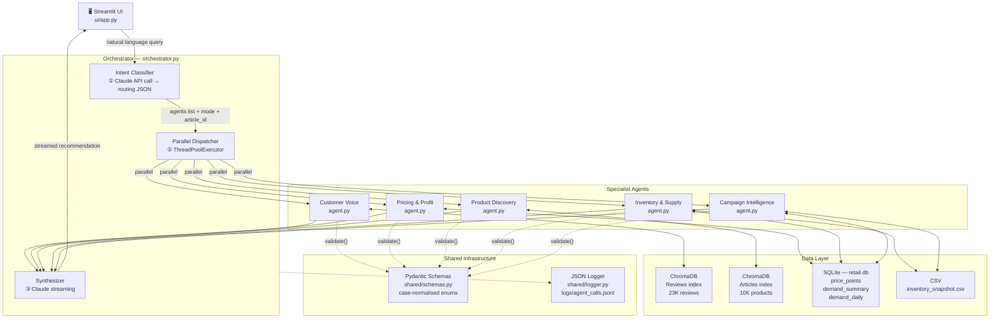
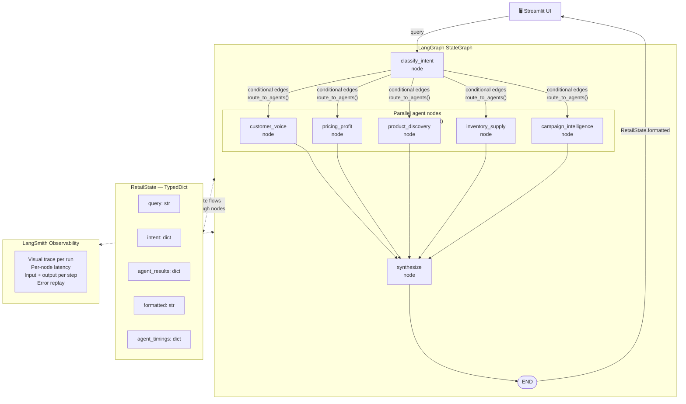

# Architecture Diagrams

Render these in VS Code with the **Markdown Preview Mermaid Support** extension,
or view directly on GitHub (Mermaid renders natively in GitHub markdown).

---

## Reference Architecture — Raw Anthropic SDK (pre-migration)

---

## Current Architecture — LangGraph

---

## What changed in the migration

| Concept | Raw SDK (reference) | LangGraph (current) |
|---|---|---|
| Routing logic | `if/elif` in `orchestrator.py` | Conditional edges on the graph |
| Parallel dispatch | `ThreadPoolExecutor` | LangGraph `Send` API (fan-out) |
| State passing | Plain `dict` returned from `run()` | Typed `RetailState` TypedDict with merge reducers |
| Observability | `print()` + JSONL log file | LangSmith visual trace |
| Agent code | ✅ Unchanged | ✅ Unchanged |
| Prompts | ✅ Unchanged | ✅ Unchanged |
| Tests | 26 passing | 25 passing |

## What stayed the same

All 5 `agents/*/agent.py` files — the actual business logic, data access,
and Claude API calls — were not touched. LangGraph wraps the orchestration
layer only. The agents became nodes; their existing methods are called
from within those nodes.
